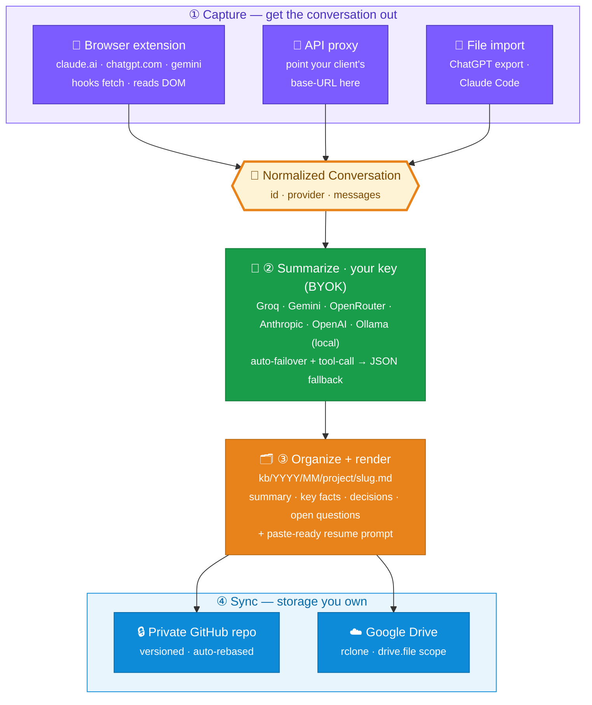

# Engram

Your AI conversations, remembered.

I kept losing context. A long Claude thread where we'd worked out an architecture, a ChatGPT chat full of debugging history, the project setup I'd explained five times across different tools — all of it locked inside someone else's product, one policy change or deleted-history click away from being gone. Models don't remember you between sessions, and the part that actually matters — the back-and-forth, the decisions, the project context — lives in walled gardens you don't control.

Engram fixes that. It takes your conversations out of Claude, ChatGPT, and the API, distills each one into a clean Markdown note, and stores those notes in a private Git repo (and optionally Google Drive) that *you* own. Switch models, get rate-limited, lose access, start a fresh chat — your accumulated context is still there, searchable and yours. Every note even ends with a paste-ready prompt to resume the work in any model.

> An *engram* is the physical trace a memory leaves in the brain. This does the same thing for your chats.

## The problem it solves

LLMs are stateless. The provider stores your *messages* so the UI can show them, but they don't store your *knowledge*, and you can't easily get it out in a form that's useful later. The real asset isn't the model — it's the transcript: what you were building, what you decided and why, what's still open. Today that asset is:

- **Trapped** — exportable at best as a giant JSON blob, not something you can read, search, or hand to another model.
- **Fragile** — bans, revoked access, deleted history, and silent retention changes can erase it.
- **Siloed** — your Claude history can't see your ChatGPT history, and neither survives you switching tools.

Engram turns that transcript into something durable: owned, versioned in Git, greppable, and model-agnostic.

## How it works

Four stages — capture the conversation, summarize it with your own key, organize the note on disk, and sync it to storage you own:



**Read it as a funnel.** Three capture surfaces (purple) all produce one shape — the **normalized `Conversation`** (the gold hub). That single contract is the whole trick: any capture source pairs with any provider, because neither side knows about the other. From the hub it's always the same three steps — summarize (green) → render a note (orange) → sync to storage you own (blue).

**Two ways to run the engine.** The **self-contained extension** does stages ②–④ right in the browser (set a key in its Options, optionally a GitHub token). Or run the local **`engram serve` daemon** and the extension just feeds it captures while your keys stay on your machine. Same pipeline either way.

**Capture.** Getting the conversation out is the hard part, and it differs by surface:

- *Web* (claude.ai, chatgpt.com) — a browser extension that hooks the page's own network calls and reads the conversation JSON the site already fetched. It intercepts `fetch`; it does **not** scrape the DOM, so a UI redesign doesn't break it.
- *API* — a tiny local proxy you point your client's base URL at. It forwards your request untouched (your key passes straight through, never stored) and keeps a copy of the exchange. Because every chat request already includes the full message history, the capture is complete.
- *Files* — point it at a ChatGPT data export or a Claude Code transcript and it parses those directly.

**Summarize.** Each conversation goes through an LLM — *your* key, your choice of provider — that returns a structured note: title, project, topics, a short summary, the key facts, the decisions and their rationale, the open questions, and a resume prompt. The model is forced to emit valid JSON (Anthropic tool-use / OpenAI function-calling), so there's no flaky text parsing.

**Organize.** Notes are written to `kb/YYYY/MM/<project>/<slug>-<hash>.md` — so the path alone tells you when and what, and topics in the front-matter make it searchable in Obsidian, `grep`, or any script. The `<hash>` is derived from the source conversation id, which keeps re-runs idempotent and ties each note back to its origin.

**Sync.** `engram sync` commits the knowledge base to a private Git repo (your durable, versioned backup) and mirrors it to Google Drive via rclone. Both steps are best-effort and independent — a Drive hiccup never blocks the Git push.

A finished note looks like this:

````markdown
---
title: Designing a rate limiter
date: 2026-06-20
project: engram
provider: claude
topics: [redis, sliding-window, api]
source_id: 11111111-2222-3333-4444-555555555555
---

# Designing a rate limiter

Worked out a sliding-window rate limiter for an Express API...

## Decisions
- Sliding window in Redis, updated atomically with a Lua script — avoids the race a naive counter has.

## Open questions / next steps
- How to handle clients behind shared NAT.

## Resume prompt
```text
We were designing a rate limiter for an Express API. We chose a sliding window
in Redis with a Lua script for atomic updates... pick up from here.
```
````

## Quick start

```bash
git clone https://github.com/Sufian-Abu/engram.git
cd engram && npm install
npm run setup        # creates .env + a local KB repo, builds the extension
# paste a free Groq key into .env (https://console.groq.com/keys), then:
npm start            # runs the auto-capture daemon
```

Then load `packages/extension/dist` at `chrome://extensions` (Developer mode → Load unpacked), and open a conversation on claude.ai or chatgpt.com — it's captured, summarized, and saved automatically.

### No terminal at all (self-contained extension)

You don't actually need the daemon. Open the extension's **Settings** (the popup's ⚙, or right-click → Options), paste a free provider key, and optionally a GitHub token + `owner/repo`. From then on the extension summarizes each conversation **in the browser** and pushes the note straight to your private repo — no clone, no `npm`, no daemon. The daemon above is just the local-first alternative for people who'd rather keep keys out of the browser.

Prefer to do it by hand? The pieces are all scriptable:

```bash
npm run ingest -- samples/   # turn a chat (file/dir/export) into a KB note
npm run sync                 # commit + push the KB, mirror to Drive
```

### Bring your own key (one is enough, several are free)

Engram never ships a key — you use your own, so there's no cost or trust handed to me, and your conversations only ever touch your provider and your storage. It picks the first key it finds; override with `ENGRAM_PROVIDER`.

| Provider | Cost | Default model | Env var |
| --- | --- | --- | --- |
| Groq | free | `llama-3.3-70b-versatile` | `GROQ_API_KEY` |
| Google Gemini | free tier | `gemini-2.0-flash` | `GEMINI_API_KEY` |
| OpenRouter | free models | `meta-llama/llama-3.3-70b-instruct:free` | `OPENROUTER_API_KEY` |
| Anthropic | paid | `claude-sonnet-4-6` | `ANTHROPIC_API_KEY` |
| OpenAI | paid | `gpt-4o-mini` | `OPENAI_API_KEY` |
| **Ollama** | **local, no key** | `llama3.1` | — run [Ollama](https://ollama.com), set `ENGRAM_PROVIDER=ollama` |

Set keys for several and Engram **fails over** automatically when one is rate-limited. Bigger-context providers (Gemini, Claude) get more of the conversation, so they summarize better than a tight free tier. For full privacy with no cloud at all, use **Ollama** — summaries run on your own machine.

### Capturing real conversations

**The browser extension** (Claude + ChatGPT). It's not on the Chrome Web Store — it installs unpacked, which is fine for a dev tool and keeps you in control of exactly what's running. Two ways to get it:

*Build from source:*

```bash
git clone https://github.com/Sufian-Abu/engram.git
cd engram && npm install
npm run build -w @engram/extension     # outputs packages/extension/dist
```

*Or grab a prebuilt zip* from the [Releases page](https://github.com/Sufian-Abu/engram/releases) and unzip it.

Then load it in any Chromium browser (Chrome, Edge, Brave, Arc):

```text
chrome://extensions  →  enable Developer mode  →  Load unpacked  →  pick the dist/ (or unzipped) folder
```

Open a conversation on claude.ai or chatgpt.com — the toolbar badge counts what it captures.

**Hands-off mode (recommended).** Run the local daemon once and the extension does the rest — every conversation you open is summarized and pushed automatically, no clicking:

```bash
npm run serve        # starts the daemon on localhost:8765
```

The extension posts each capture to it; the daemon ingests and (after a short debounce) syncs to your KB repo and Drive. The popup shows **● Auto-sync on** when it's connected. Leave it running, or set it to start at login (see below).

**Manual mode.** No daemon? The popup's **Export JSON** still works:

```bash
npm run ingest -- ~/Downloads/engram-claude-conversations.json
```

API (point your client at the proxy; your key passes through):

```bash
npm run proxy
# ANTHROPIC_BASE_URL=http://localhost:8788   OPENAI_BASE_URL=http://localhost:8788/v1
npm run ingest -- ./.engram/api
```

## Where your data lives

The knowledge base belongs in its **own** private repo, separate from this code. Clone it, point Engram at it, and your notes version and push independently:

```bash
git clone git@github.com:<you>/engram-kb.git ~/engram-kb
export ENGRAM_KB_DIR=~/engram-kb
npm run ingest -- <your-chats>
npm run sync
```

Nothing leaves your machine except the summarize call to your chosen provider and the sync to your own Git/Drive. This source repo gitignores `kb/` so a stray conversation can never be committed here. See [SECURITY.md](SECURITY.md) for credential handling (and use a **fine-grained, repo-scoped** GitHub token, not a classic `repo` one).

### Mirror to Google Drive (optional)

A second copy on Drive, in case you lose the repo. Engram uses [rclone](https://rclone.org); connect it once:

```bash
rclone config
```

Walk through: **`n`** (new remote) → name **`gdrive`** → storage **`drive`** → leave `client_id`/`client_secret` blank → **scope: `3`** → blank for the rest → advanced **`n`** → browser auth **`y`** → sign in → **Allow**.

Two prompts matter:

- **Scope `3` (`drive.file`)** — pick this. It's least-privilege: rclone can touch **only the files it creates** (your `engram-kb` folder), not the rest of your Drive. (Scope `1` grants access to your *entire* Drive — avoid it.)
- **"Configure this as a Shared Drive (Team Drive)?" → `n`.** Say no; with `drive.file` rclone can't list Team Drives and you'd get a `403`. You want your personal Drive.

Then point Engram at it and sync:

```bash
echo 'ENGRAM_DRIVE_REMOTE=gdrive' >> .env
npm run sync          # → "Mirrored to gdrive:engram-kb"
```

Only your notes are mirrored — `engram sync` excludes `.git/` and dotfiles. To revoke later: `rclone config delete gdrive`, then remove access at [myaccount.google.com/connections](https://myaccount.google.com/connections).

## How capture works, and its limits

Capture reads the conversation JSON the site already fetches (Claude, ChatGPT) or, for Gemini, reads the page DOM. A few things worth knowing:

- **It captures as you chat.** When you send a message, the extension waits for the reply to finish and re-pulls the conversation, so new chats are saved without reloading. If a capture ever seems missing, reloading the tab always forces it.
- **Unofficial interfaces.** These are undocumented endpoints/DOM that providers can change at any time, which may break capture until the selectors/URLs are updated. Engram only ever *reads* conversations you open — it never sends messages or touches your account.
- **Gemini is best-effort.** It's DOM-based and the newest; if it misses turns, that's the selectors needing a tune-up — please open an issue with a sample.
- **Free-tier limits.** Free provider keys have token/minute caps. Engram truncates oversized chats and fails over to your other configured providers, but a large backlog can still hit limits briefly — it recovers within a minute.

## Project layout

It's a small TypeScript monorepo:

- **`@engram/core`** — the engine: parsers, the summarizer, the file layout, the Markdown renderer.
- **`@engram/cli`** — `engram ingest <path>` and `engram sync`.
- **`@engram/extension`** — the Manifest V3 browser extension (Claude + ChatGPT).
- **`@engram/proxy`** — the API capture proxy.

```bash
npm run build    # type-check + compile everything
npm test         # the test suite (parsers, summarizer, capture, wiring)
```

## Extending Engram

Everything flows through one contract — the normalized `Conversation`:

```ts
interface Conversation {
  id: string;                 // stable id; one note per conversation
  provider: "claude" | "chatgpt" | "gemini";
  title?: string;
  messages: { role: "user" | "assistant" | "system" | "tool"; content: string; timestamp?: string }[];
}
```

A **capture source** produces one; the **summarizer** consumes one. Because the two sides only agree on this shape, each is easy to extend on its own. There are three extension points.

### Add a summarizer provider

All providers live in one registry: [`packages/core/src/providers.ts`](packages/core/src/providers.ts). Most speak the OpenAI chat-completions shape, so adding one is a few lines:

```ts
const mistral: ProviderSpec = {
  id: "mistral",
  label: "Mistral",
  flavor: "openai",            // "openai" | "anthropic"
  baseUrl: "https://api.mistral.ai/v1/chat/completions",
  defaultModel: "mistral-large-latest",
  keyEnv: "MISTRAL_API_KEY",
  free: false,
  maxInputChars: 80_000,       // how much transcript to send (context-window aware)
};
// …then add it to ALL_PROVIDERS
```

That's all — provider **failover**, the **JSON-mode fallback** (for models without tool support), the CLI's key chain, and the extension's Options dropdown all pick it up automatically. Only if the provider has a genuinely different request/response shape do you add a `flavor` branch in [`llm-client.ts`](packages/core/src/llm-client.ts).

### Add a web-capture source

Web providers implement one small interface ([`providers/types.ts`](packages/extension/src/providers/types.ts)):

```ts
interface WebProvider {
  id: ProviderId;
  matchUrl(url: string): boolean;                 // is this a conversation fetch?
  parse(payload: unknown): Conversation | null;   // provider JSON → normalized
  matchSendUrl?(url: string): boolean;            // optional: capture live as you chat
  conversationUrlFromSend?(url: string): string | null;
}
```

Write `parse` defensively (the response schema is the provider's, not yours), drop the file in [`packages/extension/src/providers/`](packages/extension/src/providers/), and register it in `providers/index.ts`. The interceptor and service worker are provider-agnostic — they route by your `matchUrl`. See [`claude.ts`](packages/extension/src/providers/claude.ts) for a full network-capture example, or [`gemini.ts`](packages/extension/src/providers/gemini.ts) for the DOM-capture variant.

### Add a file parser

Exports (ChatGPT data export, Claude Code transcripts, …) are parsed in [`packages/core/src/parsers/`](packages/core/src/parsers/). Add a `parseX(raw): Conversation | Conversation[]` plus a detector in `parseAny` ([`parsers/index.ts`](packages/core/src/parsers/index.ts)), and `engram ingest` reads the new format for free.

Each piece is small and unit-tested in isolation, so a new provider or parser has an obvious place to add a test alongside it.

## Status

The engine, CLI, browser extension, and API proxy all work today, end to end. Claude and ChatGPT capture via network interception; Gemini capture is newer and DOM-based (best-effort — see the caveats above). Next up: publishing the extension to the Chrome Web Store, and desktop-app capture via a local HTTPS proxy.

## Contributing

Issues and pull requests are welcome — see [Extending Engram](#extending-engram) for the three places most contributions land. CI runs build, type-check, and tests on every PR; please add a test alongside new code and keep it `npm run build && npm test`-clean.

Good first issues: tune the **Gemini** DOM selectors, add a **provider** or **file parser**, or wire the popup to ingest without the manual export. For anything touching credentials, read [SECURITY.md](SECURITY.md) first.

## License

MIT — see [LICENSE](LICENSE). It's open source: clone it, run it, fork it, ship it.
